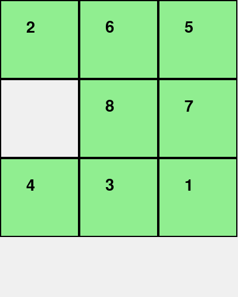

# 8PuzzleSolver

## 1. Mục tiêu

Mục tiêu của bài toán là tìm ra dãy hành động (chuỗi trạng thái) để chuyển từ trạng thái ban đầu (initial state) đến trạng thái đích (goal state) trong trò chơi 8-Puzzle, sử dụng các thuật toán tìm kiếm trong trí tuệ nhân tạo. Qua đó, giúp hiểu và áp dụng các thuật toán tìm kiếm cổ điển và có heuristic, so sánh hiệu quả của các thuật toán khác nhau. Đồng thời, củng cố kiến thức về biểu diễn trạng thái, mở rộng trạng thái và hàm heuristic.

## 2. Nội dung

### 2.1. Các thuật toán Tìm kiếm không có thông tin (Uninformed Search)

#### Thành phần chính của bài toán tìm kiếm

- **Trạng thái ban đầu (Initial State):** vị trí ban đầu của các ô số trong 8-Puzzle.
- **Tập hành động (Actions):** di chuyển ô trống (lên, xuống, trái, phải).
- **Trạng thái kế tiếp (Transition Model):** trạng thái mới sau khi thực hiện một hành động.
- **Trạng thái đích (Goal State):** trạng thái mà các ô được sắp xếp đúng thứ tự.
- **Chi phí đường đi (Path Cost):** tổng số bước di chuyển từ trạng thái ban đầu đến trạng thái đích.
- **Solution là gì?:** là chuỗi hành động hoặc dãy trạng thái dẫn từ trạng thái ban đầu đến đích.

|  |  |
|:---------------:|:---------------:|
| **Mô phỏng BFS** | **Mô phỏng IDS** |

### 2.2. Các thuật toán Tìm kiếm có thông tin (Informed Search)

### 2.3. Các thuật toán Tìm kiếm cục bộ (Local Search)

### 2.4. Các thuật toán Tìm kiếm trong môi trường phức tạp (Complex Environments)

### 2.5. Các thuật toán Tìm kiếm CSPs - Constraint Satisfaction Problems

### 2.6. Các thuật toán Tìm kiếm Học tăng cường (Reinforcement Learning)

## 3. Kết luận
