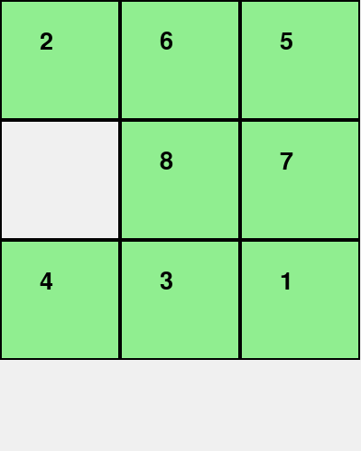
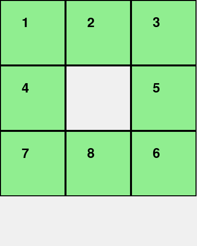
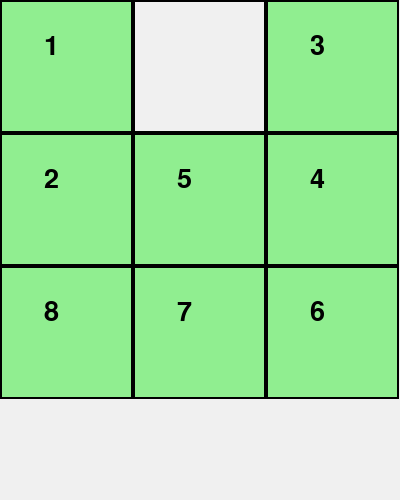
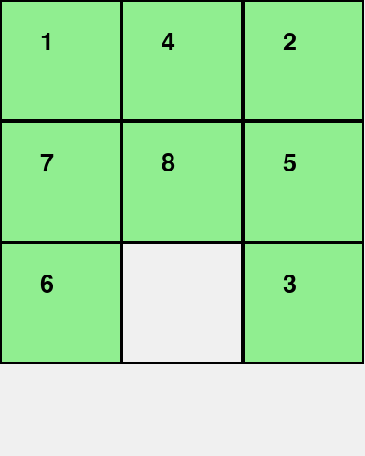
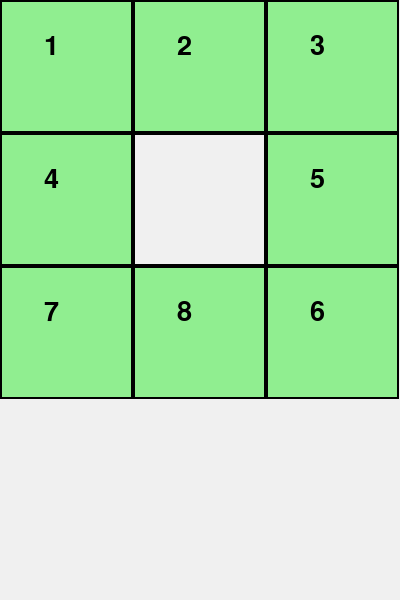

# 8PuzzleSolver

## 1. Mục tiêu

Mục tiêu của bài toán là tìm ra dãy hành động (chuỗi trạng thái) để chuyển từ trạng thái ban đầu (initial state) đến trạng thái đích (goal state) trong trò chơi 8-Puzzle, sử dụng các thuật toán tìm kiếm trong trí tuệ nhân tạo. Qua đó, giúp hiểu và áp dụng các thuật toán tìm kiếm cổ điển và có heuristic, so sánh hiệu quả của các thuật toán khác nhau. Đồng thời, củng cố kiến thức về biểu diễn trạng thái, mở rộng trạng thái và hàm heuristic.

## 2. Nội dung

### 2.1. Các thuật toán Tìm kiếm không có thông tin (Uninformed Search)

#### Thành phần chính của bài toán tìm kiếm

- **Trạng thái ban đầu (Initial State):** vị trí ban đầu của các ô số trong 8-Puzzle.
- **Tập hành động (Actions):** di chuyển ô trống (lên, xuống, trái, phải).
- **Trạng thái kế tiếp (Transition Model):** trạng thái mới sau khi thực hiện một hành động.
- **Trạng thái đích (Goal State):** trạng thái mà các ô được sắp xếp đúng thứ tự.
- **Chi phí đường đi (Path Cost):** tổng số bước di chuyển từ trạng thái ban đầu đến trạng thái đích.
- **Solution:** chuỗi hành động hoặc dãy trạng thái dẫn từ trạng thái ban đầu đến đích.

|  |  |  |  |
|:--------------------------------:|:--------------------------------:|:--------------------------------:|:--------------------------------:|
| **Mô phỏng BFS**                 | **Mô phỏng IDS**                 | **Mô phỏng UCS**                 | **Mô phỏng DFS**                 |
#### So sánh hiệu suất
| **Criterion**   | **Breadth-First** | **Uniform Cost** | **Depth-First** | **Depth-Bounded** | **Iterative Deepening** |
|-----------------|-------------------|------------------|------------------|---------------------|--------------------------|
| **Complete?**   | yes*              | yes              | no               | no                  | semi                     |
| **Optimal?**    | yes**             | yes              | no               | no                  | yes**                    |
| **Time**        | O(b^d)            | O(b^{⌈C*/ε⌉})     | O(b^m)           | O(b^ℓ)              | O(b^d)                   |
| **Space**       | O(b^d)            | O(b^{⌈C*/ε⌉})     | O(bm)            | O(b^ℓ)              | O(bd)                    |

### 2.2. Các thuật toán Tìm kiếm có thông tin (Informed Search)
#### Thành phần chính của bài toán tìm kiếm

- **Trạng thái ban đầu (Initial State):** vị trí ban đầu của các ô số trong 8-Puzzle.  
- **Tập hành động (Actions):** di chuyển ô trống (lên, xuống, trái, phải).  
- **Trạng thái kế tiếp (Transition Model):** trạng thái mới sau khi thực hiện một hành động.  
- **Trạng thái đích (Goal State):** trạng thái mà các ô được sắp xếp đúng thứ tự.  
- **Chi phí đường đi (Path Cost):** tổng số bước di chuyển từ trạng thái ban đầu đến trạng thái đích.  
- **Heuristic (Hàm ước lượng):** chi phí ước lượng từ trạng thái hiện tại đến đích, ví dụ: khoảng cách Manhattan.  
- **Solution:** chuỗi hành động hoặc dãy trạng thái dẫn từ trạng thái ban đầu đến đích.

|  |  |  |
|:----------------------------------:|:--------------------------------:|:-----------------------------------:|
| **Mô phỏng A\***                  | **Mô phỏng IDA\***              | **Mô phỏng Greedy Best-First**     |

#### So sánh các thuật toán tìm kiếm có thông tin

| **Tiêu chí**             | **Greedy Best-First Search**             | **A\***                                     | **IDA\***                                       |
|--------------------------|-------------------------------------------|----------------------------------------------|-------------------------------------------------|
| **Chiến lược**           | Chọn node có `h(n)` nhỏ nhất             | Chọn node có `f(n) = g(n) + h(n)` nhỏ nhất  | Duyệt theo DFS với ngưỡng `f_limit = g(n) + h(n)` tăng dần |
| **Cấu trúc dữ liệu**     | Priority Queue (theo `h(n)`)              | Priority Queue (theo `f(n)`)                | Stack (DFS), kết hợp lặp tăng `f_limit`         |
| **Tối ưu (Optimal)?**    |  Không                                  |  Có nếu `h(n)` admissible                 |  Có nếu `h(n)` admissible                     |
| **Hoàn tất (Complete)?** |  Không nếu không xử lý vòng lặp         |  Có nếu không có vòng vô hạn               |  Có nếu ngưỡng tăng hợp lý                    |
| **Thời gian**            | Thấp nếu heuristic tốt, nhưng dễ lạc hướng| Nhanh nếu heuristic tốt và admissible        | Có thể chậm do lặp lại nhiều                   |
| **Bộ nhớ**               | Tốn nhiều (phụ thuộc vào độ sâu và phân nhánh)| Rất tốn (O(b^d))                          | Tiết kiệm (O(d))                                |
| **Ứng dụng**             | Khi cần tốc độ, không cần kết quả tối ưu  | Khi cần giải tối ưu                         | Khi bộ nhớ hạn chế nhưng vẫn cần giải tối ưu    |

### 2.3. Các thuật toán Tìm kiếm cục bộ (Local Search)
#### Đặc điểm của tìm kiếm cục bộ

- Không lưu trữ toàn bộ đường đi từ trạng thái ban đầu đến trạng thái đích.
- Chỉ quan tâm đến trạng thái hiện tại và các trạng thái lân cận.
- Hiệu quả với không gian trạng thái lớn hoặc vô hạn.
- Không đảm bảo tìm được lời giải tối ưu.

|  |  |  |  |  |  |
|:--------------------------------------:|:-------------------------------------:|:---------------------------------------:|:-------------------------------------:|:------------------------------:|:------------------------------------:|
| **Simple Hill Climbing**              | **Steepest Ascent Hill Climbing**    | **Stochastic Hill Climbing**           | **Simulated Annealing (SA)**         | **Beam Search (k=5)**         | **Genetic Algorithm (GA)**           |

#### So sánh hiệu suất

| **Thuật toán**              | **Nguyên lý hoạt động**                                                                 | **Ưu điểm**                                           | **Nhược điểm**                                                 |
|----------------------------|------------------------------------------------------------------------------------------|------------------------------------------------------|----------------------------------------------------------------|
| **Simple Hill Climbing**   | Di chuyển đến trạng thái lân cận tốt hơn hiện tại.                                      | Đơn giản, dễ cài đặt                                 | Dễ bị kẹt ở đỉnh cục bộ hoặc cao nguyên                        |
| **Steepest Ascent HC**     | Xét tất cả các lân cận, chọn trạng thái tốt nhất.                                       | Tăng khả năng tìm được trạng thái tốt hơn            | Tốn thời gian kiểm tra, vẫn có thể kẹt                         |
| **Stochastic HC**          | Chọn ngẫu nhiên một trạng thái tốt hơn trong số các lân cận.                            | Giảm xác suất bị kẹt ở cao nguyên                    | Kết quả không ổn định, phụ thuộc ngẫu nhiên                    |
| **Simulated Annealing**    | Đôi khi chấp nhận trạng thái kém hơn để thoát khỏi đỉnh cục bộ, xác suất giảm theo thời gian. | Có thể vượt qua đỉnh cục bộ                          | Cần điều chỉnh tham số (nhiệt độ), có thể chậm                 |
| **Beam Search (k=5)**      | Duy trì k trạng thái tốt nhất ở mỗi bước.                                               | Cân bằng hiệu quả và chất lượng lời giải            | Có thể bỏ lỡ lời giải tốt nếu không nằm trong beam             |
| **Genetic Algorithm (GA)** | Mô phỏng tiến hóa sinh học: chọn lọc, lai ghép, đột biến để tạo thế hệ mới.             | Khả năng khám phá không gian rộng, lời giải đa dạng | Phức tạp, cần tinh chỉnh tham số                              |

### 2.4. Các thuật toán Tìm kiếm trong môi trường phức tạp (Complex Environments)
#### Thành phần chính của bài toán tìm kiếm trong môi trường phức tạp

- **Trạng thái ban đầu (Initial State):** vị trí hoặc tình trạng ban đầu của tác nhân trong môi trường.
- **Tập hành động (Actions):** các hành động có thể thực hiện trong môi trường, có thể bao gồm các quyết định dựa trên thông tin quan sát được.
- **Trạng thái kế tiếp (Transition Model):** trạng thái mới sau khi thực hiện một hành động trong môi trường, có thể không xác định hoàn toàn.
- **Trạng thái đích (Goal State):** trạng thái mà tác nhân muốn đạt được trong môi trường, có thể là một trạng thái không hoàn toàn xác định.
- **Chi phí đường đi (Path Cost):** tổng chi phí từ trạng thái ban đầu đến trạng thái đích, có thể bao gồm các yếu tố không chắc chắn.
- **Heuristic (Hàm ước lượng):** chi phí ước lượng từ trạng thái hiện tại đến đích, có thể dựa trên quan sát, thông tin không chắc chắn, hoặc thông tin không đầy đủ.
- **Solution:** chuỗi hành động hoặc dãy trạng thái dẫn từ trạng thái ban đầu đến đích, có thể bao gồm các quyết định trong môi trường không hoàn toàn.

|  |  |  |
|:-----------------------------------------:|:-------------------------------------------------------:|:-----------------------------------------------------:|
| **Mô phỏng BFS Uncertain**                | **Mô phỏng No Observations**                             | **Mô phỏng Partially Observable BFS**                 |

#### So sánh các thuật toán tìm kiếm trong môi trường phức tạp

| **Tiêu chí**             | **BFS Uncertain**                               | **No Observations**                               | **Partially Observable BFS**                          |
|--------------------------|------------------------------------------------|---------------------------------------------------|--------------------------------------------------------|
| **Chiến lược**           | Tìm kiếm theo chiều rộng với các quyết định dựa trên thông tin không chắc chắn | Tìm kiếm trong môi trường không có thông tin quan sát | Tìm kiếm trong môi trường có một phần thông tin quan sát |
| **Cấu trúc dữ liệu**     | Queue (theo độ sâu)                            | Queue hoặc Priority Queue (dựa trên các hành động khả thi) | Queue (theo độ sâu), kết hợp với thông tin quan sát được |
| **Tối ưu (Optimal)?**    | Không thể đảm bảo tối ưu trong môi trường không chắc chắn | Không đảm bảo tối ưu vì thiếu thông tin quan sát | Có thể tối ưu nếu các quan sát có đủ và chính xác |
| **Hoàn tất (Complete)?** | Có nếu có đủ thông tin để tìm ra giải pháp    | Không hoàn tất nếu không có bất kỳ thông tin nào về môi trường | Hoàn tất nếu có đủ quan sát và thông tin trạng thái    |
| **Thời gian**            | Thời gian tìm kiếm có thể dài do tính không chắc chắn của môi trường | Thời gian tìm kiếm có thể lâu vì thiếu thông tin quan sát | Tìm kiếm hiệu quả hơn nếu có đủ thông tin quan sát     |
| **Bộ nhớ**               | Tốn bộ nhớ cao vì cần lưu trữ tất cả các trạng thái có thể | Tốn bộ nhớ thấp, phụ thuộc vào mức độ phức tạp của môi trường | Tiết kiệm bộ nhớ nhờ việc chỉ lưu trữ thông tin cần thiết |
| **Ứng dụng**             | Khi môi trường có yếu tố không chắc chắn, cần tìm kiếm theo chiều rộng | Khi không có bất kỳ thông tin quan sát nào về môi trường | Khi môi trường có thông tin quan sát một phần và có thể dẫn tới các quyết định chính xác hơn |

### 2.5. Các thuật toán Tìm kiếm CSPs - Constraint Satisfaction Problems
#### Thành phần chính của bài toán ràng buộc (CSP)

- **Biến (Variables):** tập hợp các biến cần gán giá trị (VD: các vùng trong bản đồ, các ô trong Sudoku).  
- **Miền giá trị (Domains):** tập giá trị hợp lệ cho mỗi biến.  
- **Ràng buộc (Constraints):** điều kiện mà các giá trị gán phải thỏa mãn (VD: các vùng liền kề không trùng màu).  
- **Gán (Assignment):** một tập hợp các cặp biến-giá trị (một phần hoặc đầy đủ).  
- **Bài toán hoàn chỉnh:** khi mọi biến đều được gán và tất cả ràng buộc đều thỏa mãn.

#### Cấu trúc thuật toán Backtracking

Thuật toán Backtracking giải quyết bài toán CSP thông qua việc thử nghiệm các giá trị của các biến từ miền giá trị (domain). Nếu một giá trị gây ra vi phạm ràng buộc, thuật toán sẽ quay lại và thử giá trị khác.

- **Bước 1:** Chọn một biến chưa được gán giá trị.
- **Bước 2:** Chọn một giá trị hợp lệ từ miền giá trị của biến.
- **Bước 3:** Kiểm tra xem giá trị này có vi phạm ràng buộc hay không.
- **Bước 4:** Nếu không vi phạm, gán giá trị cho biến và tiếp tục bước 1.
- **Bước 5:** Nếu vi phạm, quay lại bước 2 và thử giá trị khác.
- **Bước 6:** Nếu không còn giá trị hợp lệ, quay lại bước 1 của biến trước đó.

|  |
|:----------------------------------------:|
| **Mô phỏng Backtracking (Sudoku)**       |

## 3. Kết luận

Dự án **8PuzzleSolver** đã giúp tiếp cận, áp dụng và so sánh toàn diện các thuật toán tìm kiếm trong trí tuệ nhân tạo thông qua một bài toán cổ điển nhưng đầy thử thách — bài toán 8-Puzzle. Một số kết quả đạt được nổi bật như sau:

- **Hiểu rõ bản chất và cơ chế hoạt động** của các nhóm thuật toán tìm kiếm: từ các thuật toán không có thông tin như BFS, DFS đến các thuật toán có sử dụng heuristic như A*, Greedy và các phương pháp cục bộ như Hill Climbing, Simulated Annealing.
  
- **Triển khai thành công và trực quan hóa** các thuật toán với mô phỏng trực tiếp trên bài toán 8-Puzzle, giúp dễ dàng quan sát và đánh giá hiệu quả giữa các phương pháp. Các hình ảnh mô phỏng đã minh họa rõ ràng quá trình tìm kiếm lời giải.

- **So sánh chi tiết hiệu suất** các thuật toán về các tiêu chí: tính tối ưu, tính hoàn tất, độ phức tạp thời gian và bộ nhớ, từ đó rút ra các trường hợp áp dụng phù hợp cho từng thuật toán.

- **Khám phá môi trường phức tạp và ràng buộc**, như môi trường không chắc chắn hoặc bài toán CSP, mở rộng phạm vi bài toán từ môi trường đơn giản đến các trường hợp thực tế hơn.

- **Kết hợp lý thuyết với thực hành** thông qua cài đặt các giải thuật, mô phỏng và đánh giá, giúp củng cố vững chắc kiến thức về trí tuệ nhân tạo và kỹ năng giải quyết bài toán AI.

Thông qua dự án này, không chỉ hiểu sâu hơn về cách các thuật toán hoạt động mà còn nâng cao tư duy phân tích, khả năng tối ưu hoá và lựa chọn thuật toán phù hợp cho từng loại bài toán cụ thể. Dự án là nền tảng tốt cho việc áp dụng AI vào các bài toán phức tạp hơn trong thực tế.

