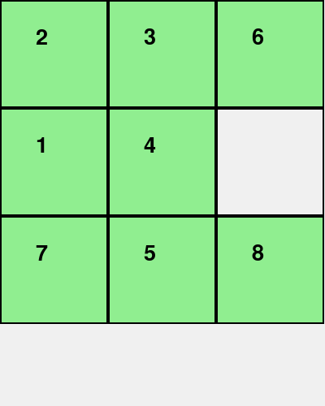

# Link video: https://www.youtube.com/watch?v=ADv3FdY6IkU
# Link github: https://github.com/anhhuyn/8PuzzleSolver.git 
# 8Puzzle
Bài toán 8-Puzzle là một trò chơi trí tuệ trên bảng 3x3 gồm 8 ô đánh số từ 1 đến 8 và 1 ô trống được sắp xếp một cách ngẫu nhiên (trạng thái đầu), chúng ta cần di chuyển các ô vào vị trí chính xác để đạt trạng thái đích. Đây là bài toán kinh điển trong trí tuệ nhân tạo, dùng để nghiên cứu các thuật toán tìm kiếm.

## 1. Mục tiêu

Vận dụng các nhóm thuật toán tìm kiếm không có thông tin (Uninformed Search), tìm kiếm có thông tin (Informed Search), tìm kiếm cục bộ (Local Search), tìm kiếm trong môi trường phức tạp (Complex Environments), CSPs (Constraint Satisfaction Problems), học tăng cường (Reinforcement Learning) vào bài toán 8-Puzzle để hiểu rõ và nắm vững hơn các thuật toán này. 

## 2. Nội dung

### 2.1. Các thuật toán Tìm kiếm không có thông tin (Uninformed Search)

#### Thành phần chính của bài toán tìm kiếm

- **Trạng thái ban đầu (Initial State):** Là cấu hình khởi đầu của lưới 3x3, vị trí ban đầu của các ô số từ 1 đến 8 và ô trống (đại diện bằng số 0). Trong bài toán này, trạng thái ban đầu được đặt cố định là initial_state = [[2, 6, 5], [0, 8, 7], [4, 3, 1]].
- **Tập hành động (Actions):** di chuyển ô trống (lên, xuống, trái, phải).
- **Trạng thái kế tiếp (Transition Model):** trạng thái mới sau khi thực hiện một hành động.
- **Trạng thái đích (Goal State):** trạng thái mà các ô được sắp xếp đúng thứ tự. Trong bài toán này, trạng thái đích cần đạt được là target_state = [[1, 2, 3], [4, 5, 6], [7, 8, 0]].
- **Chi phí đường đi (Path Cost):** tổng số bước di chuyển từ trạng thái ban đầu đến trạng thái đích. Trong tìm kiếm không có thông tin, mỗi bước di chuyển thường được gán chi phí bằng 1, nên chi phí đường đi là tổng số bước thực hiện để đạt được lời giải.
- **Solution:** chuỗi hành động hoặc dãy trạng thái dẫn từ trạng thái ban đầu đến đích.

#### So sánh hiệu suất các thuật toán
| **Criterion**   | **Breadth-First** | **Uniform Cost** | **Depth-First**  | **Iterative Deepening**  |
|-----------------|-------------------|------------------|------------------|--------------------------|
| **Complete?**   | yes*              | yes              | no               | semi                     |
| **Optimal?**    | yes**             | yes              | no               | yes**                    |
| **Time**        | O(b^d)            | O(b^{⌈C*/ε⌉})     | O(b^m)           | O(b^d)                   |
| **Space**       | O(b^d)            | O(b^{⌈C*/ε⌉})     | O(bm)            | O(bd)                    |

Trong đó:  
O: độ phức tạp (thời gian hoặc không gian)  
b: branch (số nhánh trung bình ở mỗi nút)  
d: độ sâu của lời giải tối ưu  
m: độ sâu tối đa của cây  
c*: chi phí của lời giải tối ưu  
ε: chi phí tối thiểu giữa 2 trạng thái

|  |  |  |  |
|:--------------------------------:|:--------------------------------:|:--------------------------------:|:--------------------------------:|
| **Mô phỏng BFS**                 | **Mô phỏng IDS**                 | **Mô phỏng UCS**                 | **Mô phỏng DFS**                 |

#### Nhận xét về thời gian và số bước khi áp dụng các thuật toán tìm kiếm không có thông tin lên bài toán 8-Puzzle

Với trạng thái ban đầu là initial_state = [[2, 6, 5], [0, 8, 7], [4, 3, 1]] và trạng thái đích là target_state = [[1, 2, 3], [4, 5, 6], [7, 8, 0]] 
| **Thuật toán**             | **Số bước đến lời giải** | **Thời gian** | **Nhận xét**                                                                 |
|----------------------------|---------------------------|-----------------------------------|------------------------------------------------------------------------------|
| **Breadth-First Search**   | 23 bước                 | 4,4213                           | Tìm được lời giải ngắn nhất nhưng tốn nhiều bộ nhớ và thời gian.            |
| **Uniform Cost Search**    | 23 bước         | 5,7907                              | Tương tự BFS nếu mọi bước có chi phí bằng nhau; phù hợp khi có chi phí khác nhau. |
| **Depth-First Search**     | ---           | ---                      | Ít tốn bộ nhớ, nhưng dễ đi vào nhánh sai, có thể không tìm ra lời giải khi trạng thái đầu phức tạp     |
| **Iterative Deepening**    | 27 bước                 | 1,5536                      | Kết hợp ưu điểm của DFS và BFS, tối ưu về bộ nhớ và tìm được lời giải ngắn. |

### 2.2. Các thuật toán Tìm kiếm có thông tin (Informed Search)
#### Thành phần chính của bài toán tìm kiếm

- **Trạng thái ban đầu, tập hành động, trạng thái kế tiếp, trạng thái đích và chi phí đường đi trong bài toán 8-Puzzle đều được xác định tương tự như trong các thuật toán tìm kiếm không có thông tin.
- **Heuristic (Hàm ước lượng):** chi phí ước lượng từ trạng thái hiện tại đến đích.
- **Hàm đánh giá (f(n)): f(n) = g(n) + h(n), kết hợp chi phí đến hiện tại và chi phí ước lượng tới đích.
- **Solution:** chuỗi hành động hoặc dãy trạng thái dẫn từ trạng thái ban đầu đến đích.

#### So sánh hiệu suất các thuật toán 

| **Algorithm**    | **Greedy Search** | **A\*** | **IDA\*** |
|------------------|-------------------|---------|-----------|
| **Complete?**    | NO                | YES     | YES       |
| **Optimal?**     | NO                | YES     | YES       |
| **Time**        | O(bm)             | O(bd)   | O(bd)     |
| **Space**       | O(bm)             | O(bd)   | O(d)      |

|  |  |  |
|:----------------------------------:|:--------------------------------:|:-----------------------------------:|
| **Mô phỏng A\***                  | **Mô phỏng IDA\***              | **Mô phỏng Greedy**     |

#### Nhận xét về thời gian và số bước khi áp dụng các thuật toán tìm kiếm có thông tin lên bài toán 8-Puzzle
Với trạng thái ban đầu là initial_state = [[2, 6, 5], [0, 8, 7], [4, 3, 1]] và trạng thái đích là target_state = [[1, 2, 3], [4, 5, 6], [7, 8, 0]] 

| **Thuật toán**             | **Số bước đến lời giải** | **Thời gian** | **Nhận xét**                                                             |
|----------------------------|--------------------------|-----------------------------------|-------------------------------------------------------------------------|
| **Greedy Search**          | 79 bước    | 0,0266                | Tốc độ nhanh do chỉ tập trung vào hàm heuristic, nhưng không ổn định, dễ rơi vào bẫy cục bộ và không đảm bảo tìm được lời giải tối ưu.  |
| **A\***                    | 23 bước       | 0,0254     |Là thuật toán chuẩn mực cho 8-puzzle khi có đủ bộ nhớ, đảm bảo tìm được lời giải tối ưu nhờ kết hợp chi phí thực tế và hàm heuristic.     |
| **IDA\***                  | 23 bước      | 0,8029                    | Rất phù hợp với 8-puzzle khi bộ nhớ bị giới hạn, sử dụng cấu trúc DFS kết hợp với heuristic, đảm bảo tìm được lời giải tối ưu nhưng có thể chậm hơn A*   |

### 2.3. Các thuật toán Tìm kiếm cục bộ (Local Search)
#### Đặc điểm của tìm kiếm cục bộ

- **Trạng thái ban đầu, tập hành động, trạng thái kế tiếp, trạng thái đích, chi phí đường đi, h(n), f(n), g(n) đều được xác định tương tự như trong các thuật toán tìm kiếm có thông tin.
- **Solution:** chuỗi hành động hoặc dãy trạng thái dẫn từ trạng thái ban đầu đến đích.

### So sánh hiệu suất

| **Tiêu chí**           | **Simple HC** | **Steepest HC** | **Stochastic HC** | **Simulated Annealing** | **Beam Search** | **Genetic Algorithm** |
|------------------------|---------------|------------------|--------------------|--------------------------|------------------|------------------------|
| **Complete?**          | NO            | NO               | NO                 | NO                       | NO               | NO                     |
| **Optimal?**           | NO            | NO               | NO                 | NO                       | NO               | NO                     |
| **Time**               | O(b)          | O(b)             | O(b)               | O(bc)                    | O(kb)            | O(pgb)                 |
| **Space**              | O(1)          | O(b)             | O(1)               | O(1)                     | O(k)             | O(p)                   |

**Trong đó:**  
- **b**: Số nhánh trung bình ở mỗi nút  
- **k**: Beam width (số trạng thái giữ lại ở mỗi bước)  
- **p**: Population size (kích thước quần thể)  
- **g**: Số thế hệ (generations)  
- **c**: Hằng số phụ thuộc vào lịch giảm nhiệt (trong Simulated Annealing)

|  |  |  |  |  |  |
|:--------------------------------------:|:-------------------------------------:|:---------------------------------------:|:-------------------------------------:|:------------------------------:|:------------------------------------:|
| **Simple Hill Climbing**              | **Steepest Ascent Hill Climbing**    | **Stochastic Hill Climbing**           | **Simulated Annealing (SA)**         | **Beam Search (k=5)**         | **Genetic Algorithm (GA)**           |

#### Nhận xét khi áp dụng các thuật toán tìm kiếm cục bộ lên bài toán 8-Puzzle

| **Thuật toán**             | **Nhận xét**                                                                                       |
|----------------------------|----------------------------------------------------------------------------------------------------|
| **Simple Hill Climbing**   | Dễ rơi vào điểm cực trị, không quay lui, đơn giản nhưng không hiệu quả với không gian lớn.         |
| **Steepest Ascent HC**     | Cải thiện so với Simple HC bằng cách chọn nước đi tốt nhất tại mỗi bước, nhưng vẫn dễ bị kẹt.     |
| **Stochastic HC**          | Tránh kẹt cục bộ tốt hơn nhờ chọn hành động ngẫu nhiên, tuy nhiên không đảm bảo tối ưu.           |
| **Simulated Annealing**    | Có thể thoát khỏi bẫy cục bộ nhờ chấp nhận trạng thái kém hơn theo xác suất giảm dần.             |
| **Beam Search (k=2)**      | Giữ lại k trạng thái tốt nhất tại mỗi bước, tăng độ bao quát, nhưng vẫn có thể bỏ sót lời giải tốt.|
| **Genetic Algorithm**      | Không phù hợp cho 8-puzzle vì các phép lai ghép và xáo trộn có thể phá vỡ cấu trúc của trò chơi.  |

### 2.4. Các thuật toán Tìm kiếm trong môi trường phức tạp (Complex Environments)
#### Thành phần chính của bài toán tìm kiếm trong môi trường phức tạp

- **Trạng thái ban đầu (Initial State):** vị trí hoặc tình trạng ban đầu của tác nhân trong môi trường.
- **Tập hành động (Actions):** các hành động có thể thực hiện trong môi trường, có thể bao gồm các quyết định dựa trên thông tin quan sát được.
- **Trạng thái kế tiếp (Transition Model):** trạng thái mới sau khi thực hiện một hành động trong môi trường, có thể không xác định hoàn toàn.
- **Trạng thái đích (Goal State):** trạng thái mà tác nhân muốn đạt được trong môi trường, có thể là một trạng thái không hoàn toàn xác định.
- **Chi phí đường đi (Path Cost):** tổng chi phí từ trạng thái ban đầu đến trạng thái đích, có thể bao gồm các yếu tố không chắc chắn.
- **Heuristic (Hàm ước lượng):** chi phí ước lượng từ trạng thái hiện tại đến đích, có thể dựa trên quan sát, thông tin không chắc chắn, hoặc thông tin không đầy đủ.
- **Solution:** chuỗi hành động hoặc dãy trạng thái dẫn từ trạng thái ban đầu đến đích, có thể bao gồm các quyết định trong môi trường không hoàn toàn.

|  |  |  |
|:-----------------------------------------:|:-------------------------------------------------------:|:-----------------------------------------------------:|
| **Mô phỏng BFS Uncertain**                | **Mô phỏng No Observations**                             | **Mô phỏng Partially Observable BFS**                 |

#### So sánh các thuật toán tìm kiếm trong môi trường phức tạp

| **Tiêu chí**             | **BFS Uncertain**                               | **No Observations**                               | **Partially Observable BFS**                          |
|--------------------------|------------------------------------------------|---------------------------------------------------|--------------------------------------------------------|
| **Chiến lược**           | Tìm kiếm theo chiều rộng với các quyết định dựa trên thông tin không chắc chắn | Tìm kiếm trong môi trường không có thông tin quan sát | Tìm kiếm trong môi trường có một phần thông tin quan sát |
| **Cấu trúc dữ liệu**     | Queue (theo độ sâu)                            | Queue hoặc Priority Queue (dựa trên các hành động khả thi) | Queue (theo độ sâu), kết hợp với thông tin quan sát được |
| **Tối ưu (Optimal)?**    | Không thể đảm bảo tối ưu trong môi trường không chắc chắn | Không đảm bảo tối ưu vì thiếu thông tin quan sát | Có thể tối ưu nếu các quan sát có đủ và chính xác |
| **Hoàn tất (Complete)?** | Có nếu có đủ thông tin để tìm ra giải pháp    | Không hoàn tất nếu không có bất kỳ thông tin nào về môi trường | Hoàn tất nếu có đủ quan sát và thông tin trạng thái    |
| **Thời gian**            | Thời gian tìm kiếm có thể dài do tính không chắc chắn của môi trường | Thời gian tìm kiếm có thể lâu vì thiếu thông tin quan sát | Tìm kiếm hiệu quả hơn nếu có đủ thông tin quan sát     |
| **Bộ nhớ**               | Tốn bộ nhớ cao vì cần lưu trữ tất cả các trạng thái có thể | Tốn bộ nhớ thấp, phụ thuộc vào mức độ phức tạp của môi trường | Tiết kiệm bộ nhớ nhờ việc chỉ lưu trữ thông tin cần thiết |
| **Ứng dụng**             | Khi môi trường có yếu tố không chắc chắn, cần tìm kiếm theo chiều rộng | Khi không có bất kỳ thông tin quan sát nào về môi trường | Khi môi trường có thông tin quan sát một phần và có thể dẫn tới các quyết định chính xác hơn |

### 2.5. Các thuật toán Tìm kiếm CSPs - Constraint Satisfaction Problems
#### Thành phần chính của bài toán ràng buộc (CSP)

- **Biến (Variables):** tập hợp các biến cần gán giá trị (VD: các vùng trong bản đồ, các ô trong Sudoku).  
- **Miền giá trị (Domains):** tập giá trị hợp lệ cho mỗi biến.  
- **Ràng buộc (Constraints):** điều kiện mà các giá trị gán phải thỏa mãn (VD: các vùng liền kề không trùng màu).  
- **Gán (Assignment):** một tập hợp các cặp biến-giá trị (một phần hoặc đầy đủ).  
- **Bài toán hoàn chỉnh:** khi mọi biến đều được gán và tất cả ràng buộc đều thỏa mãn.

#### Cấu trúc thuật toán Backtracking

Thuật toán Backtracking giải quyết bài toán CSP thông qua việc thử nghiệm các giá trị của các biến từ miền giá trị (domain). Nếu một giá trị gây ra vi phạm ràng buộc, thuật toán sẽ quay lại và thử giá trị khác.

- **Bước 1:** Chọn một biến chưa được gán giá trị.
- **Bước 2:** Chọn một giá trị hợp lệ từ miền giá trị của biến.
- **Bước 3:** Kiểm tra xem giá trị này có vi phạm ràng buộc hay không.
- **Bước 4:** Nếu không vi phạm, gán giá trị cho biến và tiếp tục bước 1.
- **Bước 5:** Nếu vi phạm, quay lại bước 2 và thử giá trị khác.
- **Bước 6:** Nếu không còn giá trị hợp lệ, quay lại bước 1 của biến trước đó.

|  |
|:----------------------------------------:|
| **Mô phỏng Backtracking **       |

### 2.6. Thuật toán Học tăng cường (Reinforcement Learning)

#### 2.6.1. Thành phần chính của bài toán tìm kiếm và solution

- **Tác nhân (Agent):** Là thực thể đưa ra các hành động trong môi trường, có nhiệm vụ học cách tối ưu để đạt được trạng thái mục tiêu.
- **Môi trường (Environment):** Không gian mà tác nhân tương tác, trong trường hợp này là trò chơi 8-puzzle.
- **Trạng thái (State):** Mô tả cấu hình hiện tại của trò chơi, ví dụ: vị trí của các ô số trên lưới 3x3.
- **Hành động (Action):** Bao gồm 4 hành động chính mà tác nhân có thể thực hiện: di chuyển ô trống lên, xuống, trái, phải.
- **Phần thưởng (Reward):** Giá trị mà tác nhân nhận được sau mỗi hành động. Thường là một số âm để giảm số bước đi, và số dương lớn khi đạt trạng thái đích.
- **Chính sách (Policy):** Chiến lược để chọn hành động dựa vào trạng thái hiện tại. Trong Q-Learning, chính sách thường sử dụng quy tắc ε-greedy.
- **Hàm giá trị (Value Function):** Ước lượng lợi ích dài hạn từ một trạng thái, giúp tác nhân quyết định hành động.
- **Q-Function (Hàm Q):** Hàm Q(s, a) biểu diễn phần thưởng kỳ vọng khi thực hiện hành động a tại trạng thái s và sau đó làm theo chính sách tối ưu.
- **Hệ số chiết khấu (Discount Factor - γ):** Quy định tầm quan trọng của phần thưởng tương lai so với phần thưởng hiện tại.
- **Phiên (Episode):** Một chuỗi các bước đi từ trạng thái ban đầu đến khi đạt trạng thái đích hoặc kết thúc do số bước tối đa.

**Lời giải (solution):** Là chuỗi hành động từ trạng thái khởi đầu đến trạng thái mục tiêu cuối cùng.

#### 2.6.2. Thuật toán áp dụng lên trò chơi

Thuật toán được sử dụng là **Q-Learning**, một thuật toán model-free trong học tăng cường.

##### Quy trình hoạt động:

1. **Khởi tạo Q-table:** Q(s, a) = 0 cho tất cả các trạng thái s và hành động a.
2. **Chọn hành động (ε-greedy):**
   - Với xác suất ε: chọn hành động ngẫu nhiên (khám phá - exploration).
   - Với xác suất 1 - ε: chọn hành động có giá trị Q cao nhất (khai thác - exploitation).
3. **Thực hiện hành động:** Nhận được phần thưởng r và chuyển sang trạng thái mới s’.
4. **Cập nhật Q-table:**  
   Q(s,a) ← Q(s,a) + α * [r + γ * max(Q(s’, a’)) - Q(s,a)]
   - α: learning rate
   - γ: discount factor
   - max(Q(s’, a’)): giá trị Q tốt nhất ở trạng thái tiếp theo
5. **Lặp lại:** Tiếp tục quy trình trên cho đến khi hội tụ hoặc đạt số bước tối đa.

##### Các thuật toán khác có thể áp dụng:

- **DQN (Deep Q-Learning):** Dùng mạng neural để ước lượng Q thay vì bảng Q.
- **SARSA:** Giống Q-Learning nhưng cập nhật Q dựa vào hành động thực tế tiếp theo thay vì hành động tối ưu.

#### 2.6.3. Nhận xét hiệu suất khi áp dụng lên trò chơi 8-puzzle

**Ưu điểm:**

-  **Tìm chính sách tối ưu:** Có khả năng học ra giải pháp tốt nhất qua thử nghiệm nhiều lần.
-  **Không cần biết trước môi trường:** Thuật toán model-free, không yêu cầu mô hình chuyển đổi trạng thái.
-  **Không gian trạng thái hữu hạn:** Trò chơi 8-puzzle có 9! = 362,880 trạng thái — đủ nhỏ để quản lý Q-table.

**Nhược điểm:**

-  **Không gian lớn:** Dù là hữu hạn nhưng vẫn gần 400 nghìn trạng thái, gây khó khăn lưu trữ Q-table.
-  **Chậm hội tụ:** Cần rất nhiều lần huấn luyện để đạt chính sách tốt, đặc biệt nếu chưa tối ưu ε, α, γ.
-  **Tối ưu tham số khó:** Việc chọn learning rate (α), discount factor (γ) và ε không phù hợp có thể dẫn tới quá trình học chậm hoặc không hiệu quả.

|  |
|:----------------------------------------:|
| **Mô phỏng Q-learning **       |

## 3. Kết luận

**8PuzzleSolver** đã giúp tiếp cận, áp dụng và so sánh toàn diện các thuật toán tìm kiếm trong trí tuệ nhân tạo thông qua một bài toán cổ điển nhưng đầy thử thách — bài toán 8-Puzzle. Một số kết quả đạt được nổi bật như sau:

- **Hiểu rõ bản chất và cơ chế hoạt động** của các nhóm thuật toán tìm kiếm: từ các thuật toán không có thông tin như BFS, DFS đến các thuật toán có sử dụng heuristic như A*, Greedy và các phương pháp cục bộ như Hill Climbing, Simulated Annealing.
  
- **Triển khai thành công và trực quan hóa** các thuật toán với mô phỏng trực tiếp trên bài toán 8-Puzzle, giúp dễ dàng quan sát và đánh giá hiệu quả giữa các phương pháp. Các hình ảnh mô phỏng đã minh họa rõ ràng quá trình tìm kiếm lời giải.

- **So sánh chi tiết hiệu suất** các thuật toán về các tiêu chí: tính tối ưu, tính hoàn tất, độ phức tạp thời gian và bộ nhớ, từ đó rút ra các trường hợp áp dụng phù hợp cho từng thuật toán.

- **Khám phá môi trường phức tạp và ràng buộc**, như môi trường không chắc chắn hoặc bài toán CSP, mở rộng phạm vi bài toán từ môi trường đơn giản đến các trường hợp thực tế hơn.

- **Kết hợp lý thuyết với thực hành** thông qua cài đặt các giải thuật, mô phỏng và đánh giá, giúp củng cố vững chắc kiến thức về trí tuệ nhân tạo và kỹ năng giải quyết bài toán AI. 

Thông qua dự án này, không chỉ hiểu sâu hơn về cách các thuật toán hoạt động mà còn nâng cao tư duy phân tích, khả năng tối ưu hoá và lựa chọn thuật toán phù hợp cho từng loại bài toán cụ thể. Dự án là nền tảng tốt cho việc áp dụng AI vào các bài toán phức tạp hơn trong thực tế.

# Tài liệu tham khảo
1. AlmaBetter, 8 Puzzle Problem in AI, [Online]: https://www.almabetter.com/bytes/tutorials/artificial-intelligence/8-puzzle-problem-in-ai, 01/05/2025
2. Good Audience, Solving 8-Puzzle using A* Algorithm [Online]: https://blog.goodaudience.com/solving-8-puzzle-using-a-algorithm-7b509c331288, 01/05/2025
3. GeeksforGeeks, Q-Learning in Reinforcement Learning, [Online]: https://www.geeksforgeeks.org/q-learning-in-python/, 17/05/2025
4. GeeksforGeeks, Constraint Satisfaction Problems (CSP) in Artificial Intelligence, [Online]: https://www.geeksforgeeks.org/constraint-satisfaction-problems-csp-in-artificial-intelligence/, 03/05/2025
